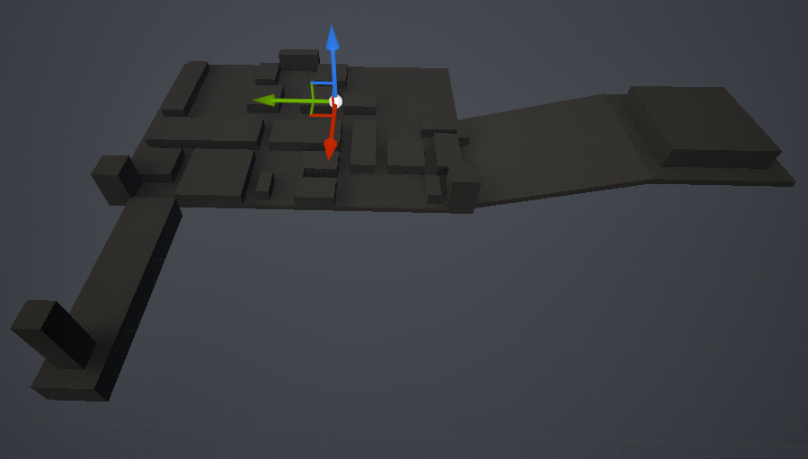

# AgencyChronicles
Investigation game based around the ability to play different investigators.

# Initial idea
Inspired by the likes of Outer Wild or Tunic, I wanted to try to play around with an exploration/investigation game.
Something not very guided, non-linear.

# Core concepts
## Different investigators
I wanted each case and clue to be solvable or obtainable in several ways. Playing as an agency with a few detectives allows players to choose how they want to approach each case.

## Keep it real
We don't want to give too many hints to the player that would not feel natural (excessive UI, highlighting objects, map objectives...). We want to challenge the player on their understanding of the world around them.
But we still need those hints as a last resort.

# State of the project
- case/clue system
- notebook UI

- tutorial case map blokcout

